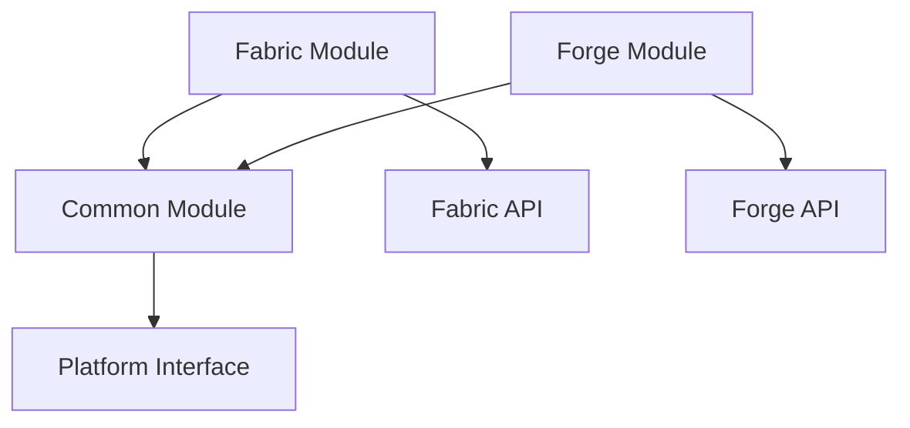

# Villages Reborn

A comprehensive village enhancement mod for Minecraft 1.21.4 that brings dynamic AI-driven villages to life with advanced NPC behaviors, procedural generation, and immersive gameplay mechanics.

## 🏗️ Architecture

Villages Reborn uses a modular architecture designed for cross-platform compatibility:

```
villagesreborn/
├── common/          # Cross-platform core logic and APIs
├── fabric/          # Fabric platform implementation
├── forge/           # Forge compatibility (planned)
└── resources/       # Shared assets and data
```

### Key Features

- **Modular Design**: Clean separation between platform-agnostic logic and platform-specific implementations
- **Secure Configuration**: Environment-based configuration with encryption support
- **Hot Reload**: Development-friendly hot reload capabilities
- **Comprehensive Testing**: Full test coverage with TDD approach
- **CI/CD Ready**: Optimized build pipeline with security scanning

## 🚀 Quick Start

### Prerequisites

- Java 21 or higher
- Minecraft 1.21.4
- Fabric Loader 0.16.14+

### Installation

1. **Clone the repository**
   ```bash
   git clone https://github.com/beeny/villagesreborn.git
   cd villagesreborn
   ```

2. **Set up environment**
   ```bash
   cp .env.template .env
   # Edit .env with your configuration
   ```

3. **Build the project**
   ```bash
   ./gradlew build
   ```

4. **Run development environment**
   ```bash
   ./gradlew devSetup
   ./gradlew :fabric:runClient
   ```

## ⚙️ Configuration

### Environment Variables

Copy `.env.template` to `.env` and configure:

| Variable | Required | Description |
|----------|----------|-------------|
| `VILLAGESREBORN_LLM_API_KEY` | Yes | API key for AI-driven village features |
| `VILLAGESREBORN_DEVELOPMENT_MODE` | No | Enable development features (default: false) |
| `VILLAGESREBORN_LOG_LEVEL` | No | Logging verbosity 0-3 (default: 1) |
| `VILLAGESREBORN_ENCRYPTION_KEY` | No | Key for config encryption (auto-generated if not set) |

### Configuration Files

Place `villagesreborn.properties` in your game directory for persistent configuration:

```properties
llm.api.key=your_api_key_here
development.mode=false
log.level=1
```

## 🔧 Development

### Module Structure

- **Common Module** (`common/`): Platform-agnostic APIs and core logic
- **Fabric Module** (`fabric/`): Fabric-specific implementations and entry points
- **Forge Module** (`forge/`): Forge compatibility layer (planned)

### Build System

```bash
# Clean all modules
./gradlew cleanAll

# Build specific module
./gradlew :common:build
./gradlew :fabric:build

# Run tests with coverage
./gradlew test testReport

# Security scan
./gradlew securityScan

# Hot reload during development
./gradlew hotReload
```

### Testing

The project follows TDD principles with comprehensive test coverage:

```bash
# Run all tests
./gradlew test

# Run tests for specific module
./gradlew :common:test
./gradlew :fabric:test

# Generate coverage report
./gradlew testReport
```

Coverage reports are generated in `build/reports/jacoco/testReport/`.

### Development Workflow

1. **Feature Development**
   ```bash
   git checkout -b feature/feature-name
   # Implement feature with tests
   ./gradlew test
   git commit -m "feat: add feature description"
   ```

2. **Hot Reload Testing**
   ```bash
   ./gradlew :fabric:runClient
   # In another terminal:
   ./gradlew hotReload
   ```

3. **Pre-commit Checks**
   ```bash
   ./gradlew build securityScan
   ```

## 🏛️ Architecture Details

### Security Model

- **Environment-based Configuration**: Sensitive data never committed to version control
- **Encryption Support**: Optional encryption for configuration values
- **Secure Defaults**: Safe fallbacks for missing configuration
- **Validation**: Runtime configuration validation with clear error messages

### Platform Abstraction

The `Platform` interface provides consistent APIs across different mod loaders:

```java
Platform platform = VillagesRebornFabric.getPlatform();
boolean isDev = platform.isDevelopmentEnvironment();
String version = platform.getMinecraftVersion();
```

### Module Dependencies



## 📦 Distribution

### Building Release

```bash
# Build production JAR
./gradlew build -Pproduction=true

# Generated artifacts:
# fabric/build/libs/villagesreborn-1.0.0.jar
# fabric/build/libs/villagesreborn-1.0.0-sources.jar
```

### Installation for Players

1. Download the latest release from [GitHub Releases](https://github.com/beeny/villagesreborn/releases)
2. Place `villagesreborn-*.jar` in your `mods/` folder
3. Install Fabric API if not already present
4. Configure API key in game directory (see Configuration section)

## 🤝 Contributing

1. Fork the repository
2. Create a feature branch: `git checkout -b feature/amazing-feature`
3. Write tests for your changes
4. Ensure all tests pass: `./gradlew test`
5. Commit your changes: `git commit -m "feat: add amazing feature"`
6. Push to the branch: `git push origin feature/amazing-feature`
7. Open a Pull Request

### Code Style

- Follow standard Java conventions
- Write comprehensive tests for new features
- Use meaningful variable and method names
- Document public APIs with Javadoc
- Keep security considerations in mind

## 📄 License

This project is licensed under the MIT License - see the [LICENSE](LICENSE) file for details.

## 🔗 Links

- [Fabric Documentation](https://fabricmc.net/develop/)
- [Minecraft Wiki](https://minecraft.wiki/)
- [Issue Tracker](https://github.com/beeny/villagesreborn/issues)
- [Discord Community](https://discord.gg/villagesreborn)

## 🏆 Phase 0 Completion

✅ **Modular Architecture**: Cross-platform module structure implemented  
✅ **Secure Configuration**: Environment-based config with encryption support  
✅ **Build System**: Optimized Gradle setup with parallel builds and caching  
✅ **Testing Framework**: Comprehensive test suite with coverage reporting  
✅ **Development Workflow**: Hot reload and development tools configured  
✅ **Documentation**: Complete setup and development documentation  

**Next Phase**: Core village mechanics and AI integration